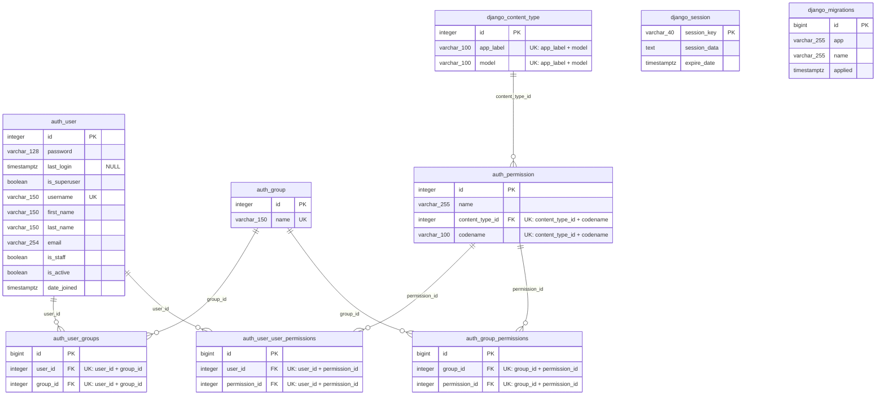

# Obecny schemat bazy danych

Diagram przedstawia aktualny schemat PostgreSQL tworzony przez wbudowane
migracje Django. Projekt nie zawiera jeszcze własnych tabel domenowych.

`django_session` nie ma klucza obcego do `auth_user`: dane użytkownika są
przechowywane wewnątrz zakodowanego pola `session_data`. `django_migrations`
jest technicznym rejestrem wykonanych migracji i również nie ma relacji z
pozostałymi tabelami.
